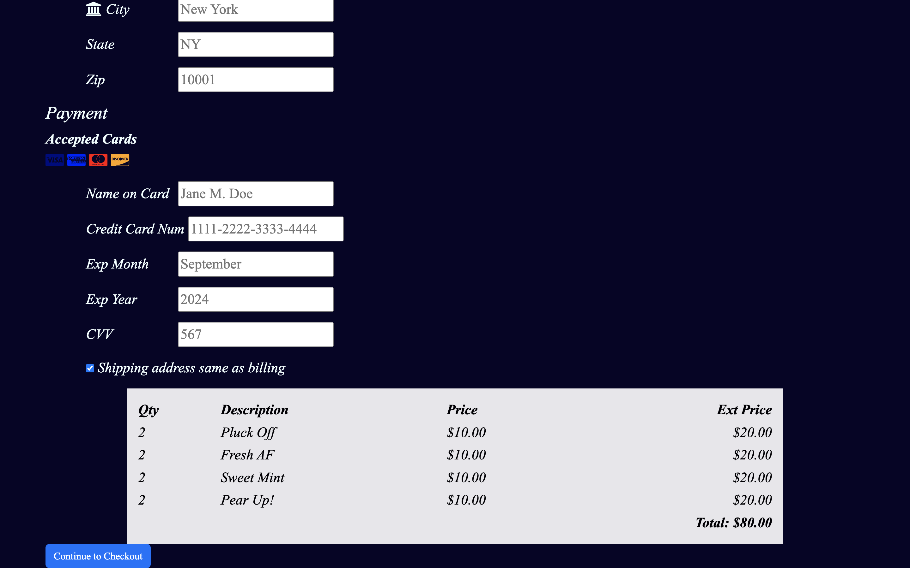

# Brooklyn Born Skin
BBS is dedicated to both body skincare and public health, offering a mindful approach to slowing the spread of germs. The products aim to create a luxurious experience that not only protects but also nurtures the skin, making daily hygiene a refreshing and enjoyable routine. 
## homepage
Logo: Showcases the brand's identity. Mission: Highlights the unique aspects of the sanitizers, including their benefits compared to competitors. Photo: Displays a woman using the sanitizer, reinforcing the brand's message. Navigation Bar: Located on the right side, allowing easy access to other pages.

## product page 
Product Display: Showcases all seven hand sanitizers. Descriptions: Details the scent profiles and the inspiration behind each product. Images: Visually compliment the sanitizers.

## register 
Sign-Up: Users can register with their email, create a username, and set a password. How Did You Hear About Us?: Asks how the user heard about the company (Google, Word of Mouth, Social Media). QR Code: Offers a free gift (a video of a mask) for users who register, part of the presentation.

## login 
Returning Customers: Users can log in to access their accounts. Remember Me: Remembering the login information.

## checkout 
Billing Information: Displays the billing address and payment details. Cart: Shows selected products and the total cost. Table: Shows the products "purchased" as well as quantity and the total amount of items "bought."

## key feauture
One standout feature of this project I've added is the QR code on the registration page, which links to a video showing the mask that customers will "receive" as a free gift upon signing up.

